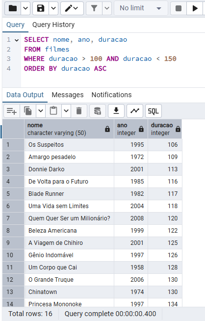
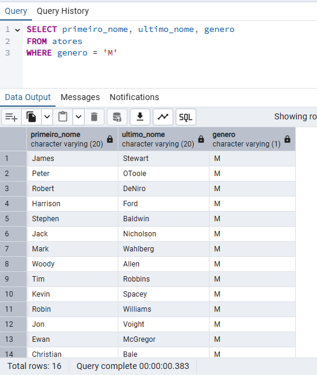

### Desafio Bootcamp - Dio
Devido a estar habituado com o Postgres, realizei a transferência do banco de dados para o formato utilizado no Postgres, dado que as consultas serão em linguagem SQL.

## Imagens das Consultas

1. Busca e nome e ano dos filmes
 

2. Busca por nome e ano em ordem crescente

3. Buscar pelo filme de volta para o futuro, trazendo o nome, ano e a duração

4. Buscar os filmes lançados em 1997

5. Buscar os filmes lançados APÓS o ano 2000

6. Buscar os filmes com a duracao maior que 100 e menor que 150, ordenando pela duracao em ordem crescente

7. Buscar a quantidade de filmes lançadas no ano, agrupando por ano, ordenando pela duracao em ordem decrescente

8. Buscar os Atores do gênero masculino, retornando o PrimeiroNome, UltimoNome

9. Buscar os Atores do gênero feminino, retornando o PrimeiroNome, UltimoNome, e ordenando pelo PrimeiroNome

10. Buscar o nome do filme e o gênero

11. Buscar o nome do filme e o gênero do tipo "Mistério"

12. Buscar o nome do filme e os atores, trazendo o PrimeiroNome, UltimoNome e seu Papel

